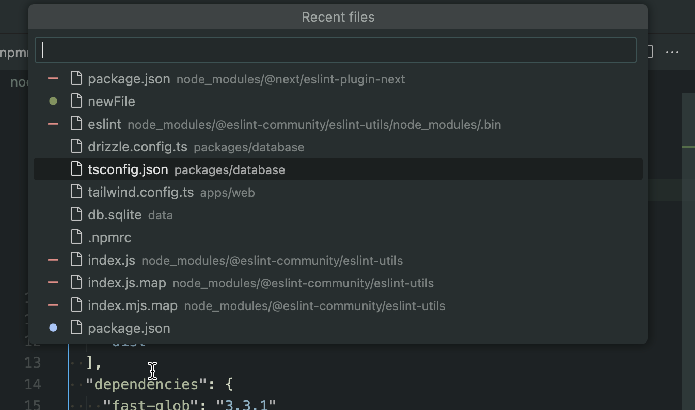

# colorful-recently-used

Usually during coding I edit just a bunch of files. But that does not mean I don't peek into other files – in fact, I do that A LOT. So when I summon my belowed "Go To File" modal... I get lost quickly. There are so many files in there – which one I need?...

Ironically, this problem is solved many decades ago with version control systems – just **highlight** the files you've added/edited and you're golden!

The Explorer pane of VSCode does that, but for some unknown reasons to me, the "Go To File" does not.

This extension tries to replicate the behaviour of "Recent files" of Jetbrains (IDEA/Webstorm/etc) highlights the files in there.

## Usage

Bind it – `colorful-recently-used.list` to something nice like `Cmd+E` and have fun!

If nothing is found, just hit Enter to open the big "Search files by name".

It always pre-selects the second item, so you can quickly jump back and forth between current and previous files by hitting `Cmd+E Enter`.

## Configuration

Plug in colors from the settings and reload the window (see "Limitations" section).

The `excludedRegexp` setting accepts a Regexp. E.g. if you want to mark both `node_modules` and `data` folders as excluded, use something like `/node_modules|data/`.

In essence, the regexp tests whether file should be marked as exlcuded like this: `new RegExp(regexpString).test(filePath)`.

## Limitations

The quick pick panel does not allow reading colors from the current theme (or do any custom stuff aside from picking a custom icon), so you will have to configure colors inside the extension settings. VSCode caches the icons, so please Reload Window (`Cmd+P` -> `Developer: Reload Window`) after each change.
